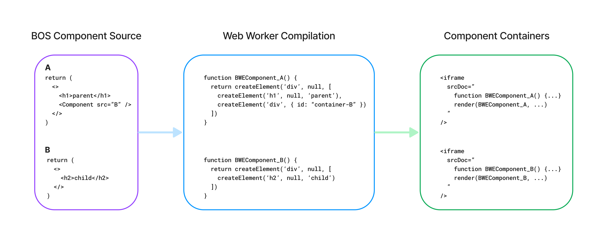

# BOS Web Engine Architecture

## Overview

BOS Web Engine is a framework for creating secure JavaScript environments for BOS Components backed by iframes. This offers
risk-free composability while supporting basic React Components, a growing set of APIs, and ultimately NPM dependencies.

### BOS Component Loading
BOS Components are loaded in BOS Web Engine by way of a client-side pipeline, responsible for BOS Component source
fetching, JSX transpilation, and Component composition. A web worker services requests from the outer application to
load new Components, caching the Component source and transpiled wrapper function. The worker responds with the wrapped
source code, which is used to initialize containers with iframes.

_High-level overview of the flow from BOS Component source to Component container._

### Component Containers
Containers are abstractions around sandboxed iframes, responsible for managing the lifecycle of a single root Component.
The outer application renders a container for each root Component, rendering the container's hidden iframe and executing
the container code in the iframe's `srcDoc` field.

Containers rely on Preact for Component lifecycle management. When a Component has updated, options hooks set in Preact
serialize the rendered node and send it to the outer application. The initial render request is explicitly triggered upon
container initialization. This Preact integration enables the use of React hooks within BOS Components.

Interactions between containers are facilitated by the iframe parent's _window_ object, e.g. `window.parent.postMessage()`. 
The outer application and individual containers register event handlers on this _window_ object to facilitate bidirectional
message passing to communicate renders and broker inter-Component callbacks. As a consequence of this, all inter-Component
communication is inherently asynchronous.

_Component containers manage root Components, which may be under another Component in the DOM tree despite being sandboxed._

### Component Callbacks (WIP)
### Trust (WIP)
